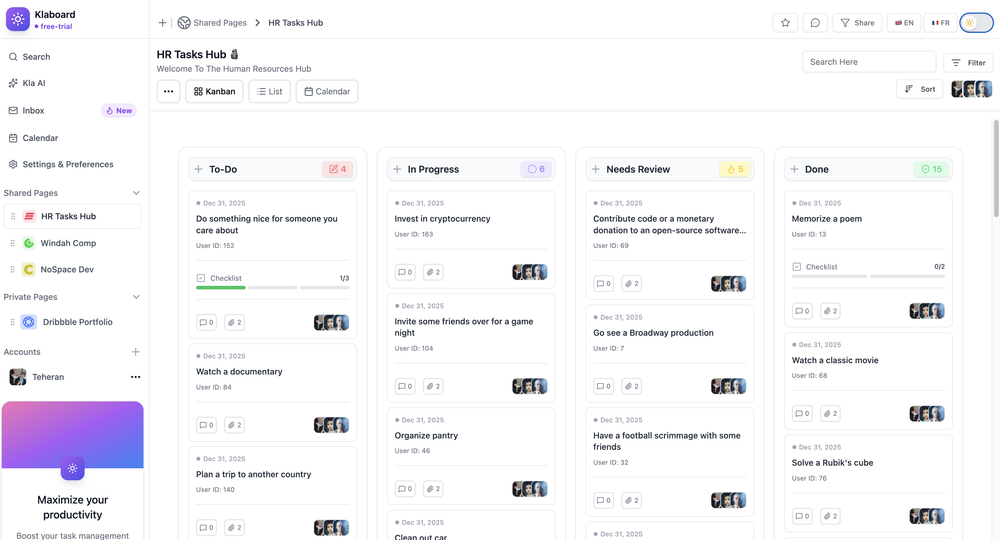

# 📋 ab-todo-frontend

A modern **Task Manager (ToDo) app** built with **React 19 + TypeScript**.

🌐 **Live Demo**: [https://verdant-sable-086ba3.netlify.app/](https://verdant-sable-086ba3.netlify.app/)



---

## ✨ Features

- 📱 **Responsive Design** — optimized for desktop and mobile
- 🌙 **Dark Mode** — toggle between light and dark themes
- 🌍 **Internationalization (i18n)** — supports English 🇬🇧 and French 🇫🇷
- ⚛️ **Modern React Stack** — React 19 features with TypeScript
- 📊 **Interactive Tables** — built with TanStack Table
- 🧭 **Navigation** — React Router v6 for client-side routing
- 🧪 **Testing** — Unit & component tests with Jest + React Testing Library
- 🎨 **Styling** — Tailwind CSS for consistent, scalable styles

---

## 🛠️ Tech Stack

- **React 19** + **TypeScript**
- **State Management**: Zustand
- **Tables**: TanStack Table
- **Router**: React Router v6
- **Styling**: Tailwind CSS
- **Testing**: Jest + React Testing Library
- **i18n**: `react-i18next`
- **Deployment**: Netlify

---

## 🚀 Getting Started

Follow these steps to set up and run the project locally.

### 1. Clone the repository

```
git clone https://github.com/your-username/ab-todo-frontend.git
cd ab-todo-frontend
```

### 2. Install dependencies

```

pnpm install

```

### 3. Environment variables

```bash
VITE_API_URL=https://dummyjson.com/todos

# Required for Netlify CLI deployments
NETLIFY_AUTH_TOKEN=your-netlify-auth-token
NETLIFY_SITE_ID=your-netlify-site-id
```

### 4. Start the development server

```
pnpm run dev
```

The app will be running at 👉 http://localhost:5173

### 5. Build for production

```
pnpm run build

```

### 6. Build for production

```
pnpm run build

```

### 7. 🧪 Running Tests

```
npm test

```

### 8. 🌍 Internationalization (i18n)

The app supports English 🇬🇧 and French 🇫🇷.
Language files are stored under src/i18n/.

### 9. 📦 Deployment

Deploy with Netlify CLI
Make sure your .env includes:

```
NETLIFY_AUTH_TOKEN=your-netlify-auth-token
NETLIFY_SITE_ID=your-netlify-site-id

```

Then run:

```
npm run build
npx netlify deploy --prod
```

## Author

- Raymond Gakwaya <raymond42.gr@gmail.com>
